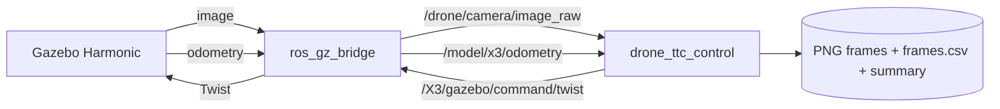

# TTC Gazebo Drone

ROS 2 + Gazebo Harmonic simulation setup for controlled **monocular
Time-to-Collision (TTC)** experiments with an X3 UAV. The project provides a
front monocular camera, simulator ground-truth odometry, velocity control, and a
repeatable data-capture state machine.

This repository is one component of a larger research software suite for
object-specific monocular TTC estimation with cascaded outlier rejection.

## What this repository contains

- an X3 UAV simulation model adapted with a **640×480, 30 Hz** front camera;
- a Gazebo TTC world with chair, person, and refrigerator-proxy targets;
- ROS/Gazebo bridges for image, odometry, and velocity command topics;
- a ROS 2 experiment controller for takeoff, stabilization, constant-speed
  forward motion, and synchronized image/odometry logging;
- a small example run showing the generated data format.

## Architecture



## Repository layout

```text
ttc-gazebo-drone/
├── src/
│   ├── drone_ttc_sim/       # Gazebo world, models and simulator launch
│   └── drone_ttc_control/   # ROS 2 experiment controller
├── docs/
├── examples/sample_run/
├── scripts/
├── THIRD_PARTY.md
└── RELEASE_CHECKLIST.md
```

## Core topics

| Topic | ROS type | Direction | Purpose |
|---|---|---|---|
| `/drone/camera/image_raw` | `sensor_msgs/msg/Image` | Gazebo → ROS | TTC image stream |
| `/model/x3/odometry` | `nav_msgs/msg/Odometry` | Gazebo → ROS | simulator ground truth |
| `/X3/gazebo/command/twist` | `geometry_msgs/msg/Twist` | ROS → Gazebo | UAV velocity command |

## Build

```bash
source /opt/ros/humble/setup.bash
cd ttc-gazebo-drone
rosdep install --from-paths src --ignore-src -r -y
colcon build --symlink-install
source install/setup.bash
```

See [docs/installation.md](docs/installation.md) for details.

## Run the simulator

Terminal 1:

```bash
source /opt/ros/humble/setup.bash
source install/setup.bash
ros2 launch drone_ttc_sim sim.launch.py
```

Check the expected interfaces:

```bash
./scripts/check_topics.sh
```

You should also see approximately 30 Hz on:

```bash
ros2 topic hz /drone/camera/image_raw
```

## Run a TTC capture experiment

Terminal 2:

```bash
source /opt/ros/humble/setup.bash
source install/setup.bash
ros2 launch drone_ttc_control experiment.launch.py
```

The default configuration commands a 0.5 m/s forward motion over 2.0 m after a
0.45 m takeoff and 3 s hover. Edit
`src/drone_ttc_control/config/experiment.yaml` or supply another ROS 2 parameter
file to change the experiment.

Generated runs are written outside the repository by default:

```text
~/ttc_gazebo_drone_data/
```

## Example output

A small excerpt from a completed simulation experiment is available under
[`examples/sample_run`](examples/sample_run). The full image datasets are not
stored in Git.

## Simulation targets and licensing

The development workspace contained several third-party Gazebo assets. This
cleaned repository avoids committing the large copied X3 meshes and replaces
the development refrigerator mesh with a primitive redistribution-safe proxy.
See [THIRD_PARTY.md](THIRD_PARTY.md) before making the repository public.

## Reproducibility status

This is a **v0.1.0 public-release candidate** generated from the research
workspace. Before publication, complete every item in
[RELEASE_CHECKLIST.md](RELEASE_CHECKLIST.md), especially the upstream X3 license
verification and maintainer-email replacement.

## Related repositories

Planned companion repositories in the TTC software suite:

- `ttc-gazebo-turtlebot`
- `tello-optitrack-capture`
- `tello-camera-calibration`
- `monocular-ttc-cascaded-outlier-rejection`

## Citation

Citation metadata is provided in [`CITATION.cff`](CITATION.cff). Update the
repository URL and, once available, the associated paper DOI before the v1.0.0
release.

## License

Original project code is provided under the BSD 3-Clause License. Upstream
Gazebo assets and model-derived files may be subject to separate terms; see
[THIRD_PARTY.md](THIRD_PARTY.md).
